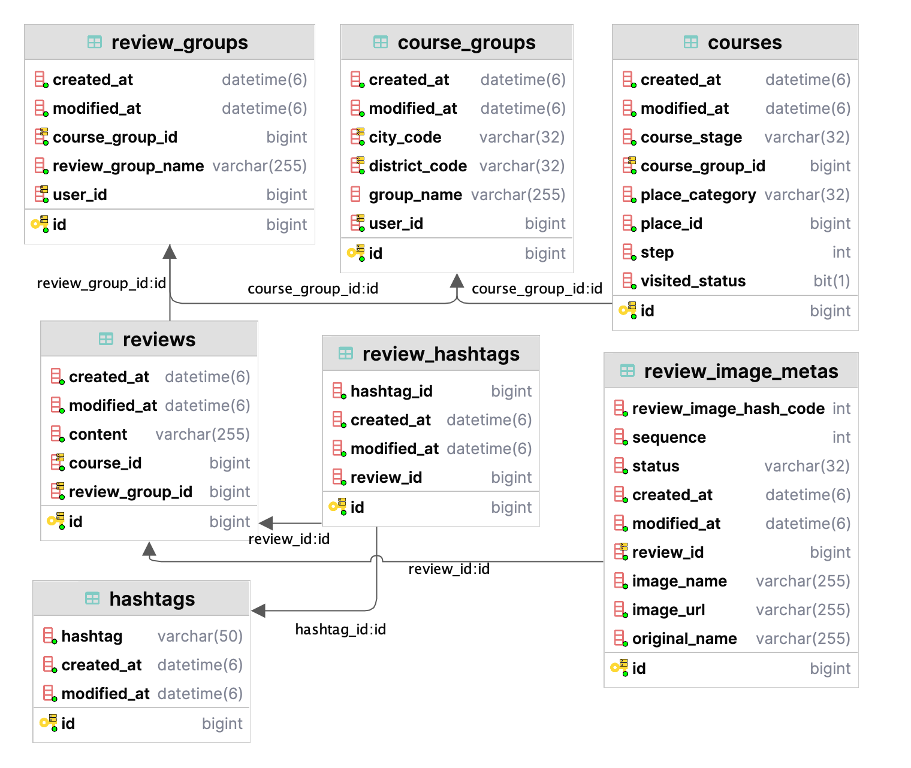

# DayPlan Content Server

## 1. 서버의 역할 및 설명
- Content Server는 유저가 데이트 코스를 작성 및 조회, 리뷰를 작성 및 조회할 수 있는 서버에요.

 

## 2. DB 구조

 

## 3. 각 기능별 구현
- > #### [지역 및 카테고리 기반 데이트 코스 짜기를 설명해요](https://github.com/DayPlan-Team/dayplan-cotent-api/blob/main/readme/DateCourseSetting.md)

- > #### [DateCourse 조회 과정을 설명해요(개발 진행 중이에요!)](https://github.com/DayPlan-Team/dayplan-cotent-api/blob/main/readme/DateCourseSearch.md)

- > #### ["접점 및 거점 테스트"로 유저가 방문한 코스 검증하기를 설명해요](https://github.com/DayPlan-Team/dayplan-cotent-api/blob/main/readme/CourseVisited.md)

- > #### [Place 정보 gRPC 및 Retorit을 비교 후 gRPC-Retrofit 함께 처리하는 과정을 설명해요](https://github.com/DayPlan-Team/dayplan-cotent-api/blob/main/readme/PlaceRrpcVsRetrofit.md)

- > #### [Course의 편집 가능 범위를 정의해요](https://github.com/DayPlan-Team/dayplan-cotent-api/blob/main/readme/DateCourseEditRange.md)
  
- > #### [리뷰 작성 및 저장을 정의해요!](https://github.com/DayPlan-Team/dayplan-cotent-api/blob/main/readme/ReviewWrite.md)
  