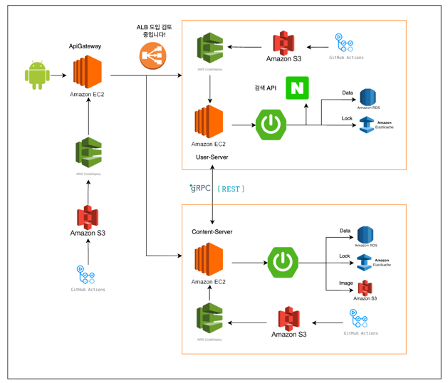

# DayPlan Content Server

## 1. 서버의 역할 및 설명
- Content Server는 유저가 데이트 코스를 작성 및 조회, 리뷰를 작성 및 조회할 수 있는 서버에요.



<br/>

## 2. 주요 도메인
- Course
  - 코스는 유저가 만들고자 하는 데이트 코스의 개별적인 장소(행동)을 의미해요
  - 흔히 "오늘 어디로 갈까?"를 의미하는 것으로 장소나 행동(액티비티) 등이 코스에 포함이 돼요.
    - "스타벅스 갔다가 영화보러 가자!"
    - "스타벅스", "영화"는 개별적인 장소나 행동을 의미하므로 각각 코스로 정의할 수 있어요.
  - 코스는 몇 번째 코스, 코스 완성 단계, 카테고리, 방문 여부 등으로 구성돼요.
``` kotlin
  data class Course(
      val courseId: Long,
      val step: Int,
      val placeId: Long,
      val courseStage: CourseStage,
      val placeCategory: PlaceCategory,
      val visitedStatus: Boolean = false,
      val groupId: Long = 0L,
  )
```
<br/>

- CourseGroup
  - 코스 그룹은 개별적인 코스를 하나의 데이트 코스로 묶어주는 역할을 것을 의미해요.
  - 데이트 코스를 짤 떄, 여러개의 코스를 순서에 맞춰서 짜게 돼요.
    - "스타벅스 갔다가 영화보러 가자!"
    - "스타벅스", "영화"를 하나의 코스로 묶는 것이 CourseGroup 이에요!
  - 이용자가 데이트 코스를 구성한다고 하면, 하나의 코스 그룹에 코스를 짜게 돼요. 
  - courseGroup은 지역, 이름, 작성자 등으로 구성돼요
``` kotlin
  data class CourseGroup(
      val userId: Long,
      val groupId: Long = 0L,
      val groupName: String = DEFAULT_NAME,
      val cityCode: CityCode,
      val districtCode: DistrictCode,
  ) {
      companion object {
          const val DEFAULT_NAME = "제목 없음"
      }
  }
```
<br/>

- ReviewGroup
  - 리뷰 그룹은 유저가 데이트 코스를 모두 방문한 경우 생성할 수 있어요.
  - 리뷰 그룹과 코스 그룹은 1:1 관계에요!
  - 하나의 리뷰 그룹과 리뷰는 1:N 관계로, 코스 그룹에 대한 코스의 리뷰를 묶어주는 개념이 리뷰 그룹이에요!
``` kotlin
  data class ReviewGroup(
      val courseGroupId: Long,
      val reviewGroupId: Long,
      val reviewGroupName: String,
      val userId: Long,
      val createdAt: LocalDateTime = LocalDateTime.now(),
      val modifiedAt: LocalDateTime = LocalDateTime.now(),
  )
```
<br/>

- Review
  - 리뷰는 유저가 데이트 코스를 모두 방문한 경우 작성할 수 있어요.
  - 리뷰와 코스는 1:1 대응 관계를 가져요!
  - 리뷰는 리뷰 그룹이 생성된 후, 리뷰를 작성하게 되면 생성이 되는 구조에요.
``` kotlin
  data class Review(
      val reviewId: Long,
      val reviewGroupId: Long,
      val courseId: Long,
      val content: String,
      val createdAt: LocalDateTime = LocalDateTime.now(),
      val modifiedAt: LocalDateTime = LocalDateTime.now(),
  )
```
<br/>

- ReviewImageMeta
  - ReviewImageMeta는 Review를 작성할 때, 저장되는 이미지의 메타 정보를 저장하는 도메인이에요!
  - 작성된 리뷰는 언제나 편집될 수 있어요!
  - 이 과정에서 매 요청마다 이미지를 수정하거나 덮어쓴다면, 리소스가 많이 소비될 수 있어요!
  - 이를 방지하기 위해 이미지에 대한 메타 정보를 저장하고, 만약 이미지가 변경되지 않는다면, 불필요한 중복 저장 혹은 덮어쓰기를 방지할 수 있어요!
``` kotlin
  data class ReviewImageMeta(
      val sequence: Int,
      val reviewId: Long,
      val originalName: String,
      val reviewImageHashCode: Int,
      val reviewImageId: Long,
      val imageName: String = "${RENAME_DEFAULT}-${UUID.randomUUID()}.${originalName.parseExtension()}",
      val imageUrl: String = "/$reviewId/$sequence/$imageName",
  )
```
<br/>

- ReviewImage
  - 바이트 배열로 정의된 ReviewImage에요.!
  - 바이트 배열을 SHA-256으로 해시한 후, 해시코드로 동일성을 비교하고자 작성하였어요!
``` kotlin
  data class ReviewImage(
      val image: ByteArray,
  ) {
    override fun equals(other: Any?): Boolean {
        if (this === other) return true
        if (javaClass != other?.javaClass) return false

        other as ReviewImage

        return image.contentEquals(other.image)
    }

    override fun hashCode(): Int {
        return sha256Digest.digest(image).contentHashCode()
    }

    companion object {
        private const val SHA256 = "SHA-256"

        val sha256Digest: MessageDigest by lazy {
            MessageDigest.getInstance(SHA256)
        }
    }
}
```
<br/>


## 3. DB 구조


<br/>

## 4. 각 기능별 구현
- > #### [지역 및 카테고리 기반 데이트 코스 짜기를 설명해요](https://github.com/DayPlan-Team/dayplan-cotent-api/blob/main/readme/DateCourseSetting.md)

- > #### [DateCourse 조회 과정을 설명해요(개발 진행 중이에요!)](https://github.com/DayPlan-Team/dayplan-cotent-api/blob/main/readme/DateCourseSearch.md)

- > #### ["접점 및 거점 테스트"로 유저가 방문한 코스 검증하기를 설명해요](https://github.com/DayPlan-Team/dayplan-cotent-api/blob/main/readme/CourseVisited.md)

- > #### [Place 정보 gRPC 및 Retorit을 비교 후 gRPC-Retrofit 함께 처리하는 과정을 설명해요](https://github.com/DayPlan-Team/dayplan-cotent-api/blob/main/readme/PlaceRrpcVsRetrofit.md)

- > #### [Course의 편집 가능 범위를 정의해요](https://github.com/DayPlan-Team/dayplan-cotent-api/blob/main/readme/DateCourseEditRange.md)
  
- > #### [리뷰 작성 및 저장을 정의해요!](https://github.com/DayPlan-Team/dayplan-cotent-api/blob/main/readme/ReviewWrite.md)

- > #### [코스와 리뷰에 유저아이디 삭제(반정규화 수정)을 설명해요! 작성 중 입니다!]()
  
<br/>

## 5. TODO
- DateCourse 조회 과정을 재정의 해야해요!