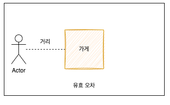
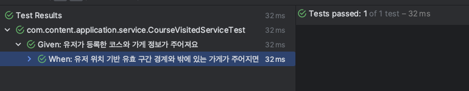

# "접점 및 거점 테스트"로 유저가 방문한 코스 검증하기

## 1. 배경
- 실제 리뷰는 데이트 코스를 실제 방문한 유저만 작성하는 기능을 검토하고 있어요.
- 유저가 데이트 코스를 작성한 후, 실제 방문했는지 확인하는 기능이 필요했어요.
- 안드로이드에서는 특정 시간 단위로 유저의 위치 정보를 전송하므로 이를 활용해야 해요.

## 2. 기능 목표
- 유효 오차는 "일정한 오차를 부여한 사각범위"로 정의해요. (유저의 위치 정보는 약간의 좌표의 오차가 있다고 가정해요)
- 위치 데이터를 바탕으로 실제 유저가 작성한 코스를 찾아서 유효 오차 내에 존재하는지 여부를 파악해요.
- 만약 유저의 데이트 코스 가게 중 유효 오차 내에 존재하는 경우 방문 여부로 체크해요.
- 유저 위치 검증은 반복적/비동기적 요청으로 수행해야해요.



## 3. 코드 구현
- 위도와 경도는 WGS84 좌표계를 기준으로 정의해요.
- 근사적 계산으로 오차 범위를 한정하고 이를 체크할 싱글턴 객체를 생성해요.
``` kotlin
    object LocationRectangleRangeCreator {

    /* 위도와 경도 약 500m 오차 */
    private const val LATITUDE_ERROR = 0.0045
    private const val LONGITUDE_ERROR = 0.0055

    fun getLatitudeRange(latitude: Double): LocationStayRange {
        return LocationStayRange(
            min = latitude - LATITUDE_ERROR,
            max = latitude + LATITUDE_ERROR,
        )
    }

    fun getLongitudeRange(longitude: Double): LocationStayRange {
        return LocationStayRange(
            min = longitude - LONGITUDE_ERROR,
            max = longitude + LONGITUDE_ERROR,
        )
    }

}
```
<br/>

- 유저가 작성한 코스 중 방문하지 않은 코스를 가져온 후, 위에 정의한 유효 범위내에 존재하는지 파악하는 로직을 구현해요.
``` kotlin

    @Service
    class CourseVisitedService(
        private val courseCommandPort: CourseCommandPort,
        private val courseQueryPort: CourseQueryPort,
        private val placePort: PlacePort,
        private val coroutineScope: CoroutineScope,
    ) {
    
        @Transactional
        fun updateCourseVisitedStatus(userLocation: UserLocation) {
            coroutineScope.launch {
    
                val (latitudeMin, latitudeMax) = LocationRectangleRangeCreator.getLatitudeRange(userLocation.latitude)
                val (longitudeMin, longitudeMax) = LocationRectangleRangeCreator.getLongitudeRange(userLocation.longitude)
    
                val courses = courseQueryPort.getCursesByUserIdAndVisitedStatus(userLocation.userId, false)
                val coursesMap = courses.groupBy { it.placeId }
    
                val coursesToUpdate = placePort.getSuspendPlaceByPlaceId(coursesMap.keys.toList())
                    .filter {
                        it.latitude in latitudeMin..latitudeMax &&
                                it.longitude in longitudeMin..longitudeMax
                    }
                    .flatMap { place ->
                        coursesMap[place.placeId]?.map { course ->
                            Course(
                                groupId = course.groupId,
                                courseId = course.courseId,
                                userId = course.userId,
                                step = course.step,
                                courseStage = course.courseStage,
                                placeId = place.placeId,
                                placeCategory = place.placeCategory,
                                visitedStatus = true,
                            )
                        } ?: emptyList()
                    }
                courseCommandPort.upsertCourses(coursesToUpdate)
            }
        }
    }

```
<br/>


- 유저가 등록한 코스의 가게 정보를 비동기로 가져온 후, 유효 범위 내 가게의 실제 위치를 필터링하였어요.
- 만약 유효 범위내에 해당한다면 해당 코스를 방문 처리하고 업데이트 해요.
``` kotlin
    val coursesToUpdate = placePort.getSuspendPlaceByPlaceId(coursesMap.keys.toList())
            .filter {
                it.latitude in latitudeMin..latitudeMax &&
                        it.longitude in longitudeMin..longitudeMax
            }
            .flatMap { place ->
                coursesMap[place.placeId]?.map { course ->
                    Course(
                        groupId = course.groupId,
                        courseId = course.courseId,
                        userId = course.userId,
                        step = course.step,
                        courseStage = course.courseStage,
                        placeId = place.placeId,
                        placeCategory = place.placeCategory,
                        visitedStatus = true,
                    )
                } ?: emptyList()
            }
        courseCommandPort.upsertCourses(coursesToUpdate)
    }
```

## 4. 테스트


- 유저가 등록한 코스의 가게 정보 및 유저 등록 코스들을 stub 하였어요.
``` kotlin
    class CourseVisitedServiceTest(
        private val courseCommandPort: CourseCommandPort = mockk(),
        private val courseQueryPort: CourseQueryPort = mockk(),
        private val placePort: PlacePort = mockk(),
        private val coroutineScope: CoroutineScope = CoroutineScope(Dispatchers.Default),
    ) : BehaviorSpec({
    
        val sut = CourseVisitedService(
            courseCommandPort = courseCommandPort,
            courseQueryPort = courseQueryPort,
            placePort = placePort,
            coroutineScope = coroutineScope,
        )
```
<br/>

- userId 및 위치 정보, 에러 범위를 정의해요.
``` kotlin
    given("유저가 등록한 코스와 가게 정보가 주어져요") {
        val userId = 1L
        val latitude = 3.0000
        val longitude = 4.0000
        val latitudeError = LocationRectangleRangeCreator.LATITUDE_ERROR
        val longitudeError = LocationRectangleRangeCreator.LONGITUDE_ERROR
```
<br/>

- stub으로 제공할 코스 및 플레이스를 정의해요.
- 접점과 거점에 해당하는 위치 구간을 선정하였어요. (+- 구간)
``` kotlin
    /* 접점 */
    Place(
        placeName = "엔젤리너스",
        placeCategory = PlaceCategory.CAFE,
        latitude = latitude + latitudeError,
        longitude = longitude + longitudeError,
        address = "중랑구",
        roadAddress = "중랑구",
        placeId = 3L,
    ),
    /* 거점 */
    Place(
        placeName = "탐앤탐스",
        placeCategory = PlaceCategory.CAFE,
        latitude = latitude + latitudeError + 0.0001,
        longitude = longitude + longitudeError + 0.0001,
        address = "중랑구",
        roadAddress = "중랑구",
        placeId = 4L,
    ),
```
<br/>

- 값을 모킹하고, 실제 접점인 courseId = 1L, 3L를 캡처하기 위해 capture를 사용하였어요.
``` kotlin
    `when`("유저 위치 기반 유효 구간 경계와 밖에 있는 가게가 주어지면") {
        every { courseQueryPort.getCursesByUserIdAndVisitedStatus(any(), false) } returns courses
        coEvery { placePort.getSuspendPlaceByPlaceId(any()) } returns places
    
        val capturedCourses = mutableListOf<List<Course>>()
        every { courseCommandPort.upsertCourses(capture(capturedCourses)) } just Runs
    
        runBlocking {
            async {
                sut.updateCourseVisitedStatus(
                    UserLocation(
                        userId = userId,
                        latitude = latitude,
                        longitude = longitude,
                    )
                )
            }
        }
```
<br/>

- 테스트를 통해 검증을 수행하여 정상적인 응답을 받았어요!
``` kotlin
    then("유효 구간 경계 내에 있는 courseId = 1, 3만 방문 처리가 되어야 해요") {
        val updatedCourses = capturedCourses.flatten()
        updatedCourses.all { it.courseId in listOf(1L, 3L) } shouldBe true
    }
```


## 5. 추가 개선 사항
- 현재 등록한 코스를 수정하는 작업에 대해서는 코드를 구현하지 못하였어요.
  - 등록한 코스를 수정하는 경우 place 정보가 바뀌게 돼요.
  - 이 경우 방문 하지 않은 place를 등록하였는지 체크하는 로직이 필요해요.
  - 이 과정은 현재의 관심사가 아니여서 다른 피처로 개선할 목적이에요!