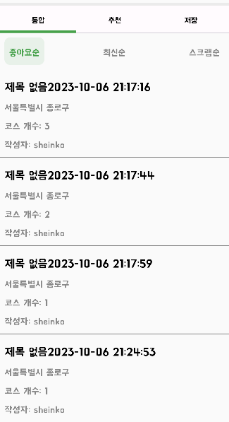

# 데이트 코스 찾기를 설명해요

## 1. 배경
- 데이트 코스 찾기는 [지역 기반 검색](https://github.com/DayPlan-Team/dayplan-cotent-api/blob/main/readme/DateCourseSetting.md)을 기본으로 설정하였어요. (링크의 2번 기능 구현 파트에 지역 기반 정의 설명)
- 유저들이 작성한 데이트 코스를 찾을 수 있도록 하는 것이 목표에요.

<br/>

## 2. 현재 개발 상태
- 지금은 어떠한 제약 조건을 부여할 것인지가 명확하지 않아서 임시로 개발을 중단한 상태에요.
  - 작성한 데이트 코스는 하나의 데이트 코스 그룹에 포함되어 있는 코스 중 하나라도 방문한 경우에는 수정을 불가하도록 처리할 예정이에요.
  - 이렇게 완성된 데이트 코스만 검색할 수 있도록 할 것인지 혹은 완성되지 않은 코스도 조회할 수 있도록 할 것인지에 대한 깊은 고려가 필요해요.
- 현재 구성은 코스 완료가 되지 않은 상태도 조회가 되도록 구성되어 있어서, 개선을 목표로 하고 있어요.



## 3. 변하지 않을 기능
- 해당 찾기는 슬라이스 방식을 적용하여 스크롤을 내릴 때 조회가 되도록 안드로이드를 구성할 예정이에요.
  (안드로이드가 익숙하지 않아서 개발이 조금 지연되고 있어요)
- 어댑터 계층에서 JPA로 slice 형태로 entity를 가져오면, 이를 도메인으로 변환하되 slice의 장점을 일부 활용할 수 있도록 하였어요.
  - 엔티티는 도메인 모델로 변경하고, 다음 데이터가 존재하는지 확인할 수 있는 hasNext 값을 활용하려고 했어요.

``` kotlin
    return CourseGroupListSearchResponse(hasNext = sliceCourseGroupEntity.hasNext(),
        courseGroupItems = sliceCourseGroupEntity.content.map {
            CourseGroupItem(
                title = it.groupName,
                groupId = it.id,
                cityName = it.cityCode.koreanName,
                districtName = it.districtCode.koreanName,
                courseCategories = courseToDataMap[it.id]?.map { course ->
                    CourseStepItem(
                        step = course.step,
                        courseId = course.courseId,
                        category = course.placeCategory,
                    )
                }?.sortedBy { courseStep ->
                    courseStep.step
                } ?: emptyList(),
                modifiedAt = DateTimeCustomFormatter.timeToDateMinuteFormat(it.modifiedAt),
            )
        }
```
- 어플리케이션 계층은 어댑터 계층에 정의된 엔티티를 모른 상태로 Slice<DomainModel> 형태로 값을 받아서 처리할 수 있어요.
