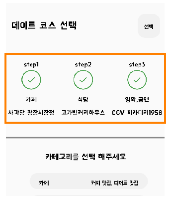

# 지역 및 카테고리 기반 데이트 코스 짜기
<br/>

## 1. 배경
- 데이플랜 프로젝트의 주요 기능인 데이트 코스 짜는 기능을 구성해요.
- 데이트 코스는 위치 선택과 데이트 활동 카테고리 선택, 장소 선택으로 이뤄져요.

## 2. 기능 구현
- 데이트 코스는 지역 기반으로 3단계 행정체계를 이용하며 도/특별시/광역시 -> 시/군/구 단위까지 선택해요.
- 데이트 활동 카테고리는 카페, 영화관, 도서관 등으로 이뤄지는 장소의 특성 카테고리를 의미해요.
- 장소 선택은 앞 서 선택한 지역과 카테고리를 바탕으로 리스트가 주어지면 유저가 희망하는 곳을 선택할 수 있어야 해요.
- 장소를 클릭하면 해당 장소를 실제 지도에 위치하는 장소를 시각적으로 보여주는 기능이 필요했어요.

## 3. 지역 선택하기
- 지역을 선택하기 위한 용어를 정리해요.
- 행정구역의 도/특별시/광역시는 city, 시/군/구는 district로 정의해요.
- 해당 데이터는 개수가 적고, 바뀔 가능성도 극히 적다고 판단해서 enum으로 정의했어요.

``` kotlin
enum class CityCode(
    val code: Long,
    val koreanName: String,
) {
    DEFAULT(0, "미상"),
    SEOUL(11, "서울특별시"),
    BUSAN(21, "부산광역시"),
    /* 중략 */
```
``` kotlin
    enum class DistrictCode(
        val code: Long,
        val city: CityCode,
        val koreanName: String,
    ) {
        // 서울
        DEFAULT(10, CityCode.DEFAULT, "미상"),
        SEOUL_JONGNO(11010, SEOUL, "종로구"),
        SEOUL_JUNG(11020, SEOUL, "중구"),
```
<br/>

- 행정구역 코드는 바뀌지 않는 값이지만 SEOUL과 같은 로마자는 관용적 다수 표현이 용인돼요.
- 따라서, 미리 map으로 정의한 code로 cityCode, DistrictCode가 주어지면 이를 O(1) 시간에 가져올 수 있는 AddressUtil을 정의했어요.
``` kotlin
    private val districtsByCityCode = DistrictCode
        .values()
        .filter { it != DistrictCode.DEFAULT }
        .groupBy { it.city.code }

    private val districtByDistrictCode = DistrictCode
        .values()
        .filter { it != DistrictCode.DEFAULT }
        .associateBy { it.code }

```
<br/>

- /content/area 프리픽스로 오는 요청에 대해 city, district 코드들을 전달할 수 있는 API를 구현하였어요
``` kotlin
    @RestController
    @RequestMapping("/content/area")
    class CourseAreaController(
        private val userQueryPort: UserQueryPort,
    ) {
    
        @GetMapping("/city")
        fun getCity(
            @RequestHeader("UserId") userId: Long,
        ): ResponseEntity<LocationOuterResponse<List<LocationResponse>>> {
    
            userQueryPort.verifyAndGetUser(userId)
    
            return ResponseEntity.ok(
                LocationOuterResponse(
                    results = AddressUtil.cities.map {
                        LocationResponse(
                            name = it.koreanName,
                            code = it.code,
                        )
                    }
                ),
            )
        }
```

## 4. 코스 그룹 만들기
- 코스 그룹은 유저가 작성한 다수의 코스를 하나로 묶어주는 도메인이에요.
- 주황색 박스에 있는 개별 코스들이 하나의 데이트 코스를 구성해요. 이를 묶어주는 그룹 개념이 코스 그룹이에요.



<br/>
- 유저가 새로운 코스 생성 -> 지역 선택을 마치면 userId, 지역 정보를 바탕으로 코스 그룹을 생성해요.

``` kotlin
    @Service
    class CourseGroupService(
        private val courseGroupQueryPort: CourseGroupQueryPort,
        private val courseGroupCommandPort: CourseGroupCommandPort,
    ) {
        @Transactional
        fun upsertCourseGroup(courseGroup: CourseGroup): CourseGroup {
            return courseGroupCommandPort.upsertCourseGroup(courseGroup)
        }
```
- 어뎁터 계층에 선언된 CourseGroupEntity는 코스 그룹의 제목이 비어있을 경우 제목없음_oo 방식으로 이름을 생성해요
``` kotlin
    companion object {
        fun fromCourseGroup(courseGroup: CourseGroup): CourseGroupEntity {

            val groupName = when {
                courseGroup.groupName.isBlank() -> "${CourseGroup.DEFAULT_NAME}_${DateTimeCustomFormatter.nowToDefaultFormat()}"
                else -> courseGroup.groupName
            }

            return CourseGroupEntity(
                userId = courseGroup.userId,
                groupName = groupName,
                cityCode = courseGroup.cityCode,
                districtCode = courseGroup.districtCode,
                id = courseGroup.groupId,
            )
        }
    }
```

## 5. 코스 생성 - 카테고리 선택하기
- 지역 선택을 마치면 카테고리를 선택해야해요.
- 카테고리는 안드로이드와 서버가 동일하게 ENUM을 사용하고 있는데, 추후 서버에서 내려주는 방식을 적용할 예정이에요.


## 6. 코스 생성 - 개별 코스 저장하기
- 코스는 step이라는 개념이 존재해요. step은 방문하는 코스의 단계를 나타내요.
- 코스 최초 생성(START) -> 카테고리 선정(CATEGORY_FINISH) -> 장소 선택(PLACE_FINISH)로 코스의 상태가 변해요
``` kotlin
    @Service
    class CourseService(
        private val courseQueryPort: CourseQueryPort,
        private val courseCommandPort: CourseCommandPort,
        private val placePort: PlacePort,
    ) {
    
        @Transactional
        fun upsertCourse(request: CourseUpsertRequest) {
    
            val course = when {
                request.courseId == 0L -> createCurseStageStart(request)
                request.courseId != 0L && request.placeId == 0L -> createCourseCategoryFinish(request)
                request.courseId != 0L -> createCoursePlaceFinish(request)
                else -> throw ContentException(ContentExceptionCode.CONTENT_COURSE_BAD_REQUEST)
            }
    
            courseCommandPort.upsertCourse(course)
        }
```
<br/>

- 코스를 생성했지만 아직 장소 등록을 하지 않은 경우(카테고리만 선택)는 실제 코스를 작성한 유저인지만 검증하고 코스를 생성해요
``` kotlin
    private fun createCourseCategoryFinish(request: CourseUpsertRequest): Course {
        verifyCourseByUser(request.courseId, request.userId)

        return Course(
            userId = request.userId,
            courseId = 0L,
            groupId = request.groupId,
            step = request.step,
            placeCategory = request.placeCategory,
            placeId = request.placeId,
            courseStage = CourseStage.CATEGORY_FINISH,
        )
    }

    private fun verifyCourseByUser(courseId: Long, userId: Long) {
        require(courseQueryPort.getCourseById(courseId).userId == userId) { throw ContentException(ContentExceptionCode.USER_INVALID) }
    }
```
<br/>

- 카테고리와 장소 선택을 마친경우, 실제 유저가 만든 코스인지, 실제로 존재하는 장소인지 검증해요.
``` kotlin
    private fun createCoursePlaceFinish(request: CourseUpsertRequest): Course {
        verifyCourseByUser(request.courseId, request.userId)
        verifyPlaceId(request.groupId)

        return Course(
            userId = request.userId,
            courseId = request.courseId,
            groupId = request.groupId,
            step = request.step,
            placeCategory = request.placeCategory,
            placeId = request.placeId,
            courseStage = CourseStage.PLACE_FINISH,
        )
    }

    private fun verifyPlaceId(placeId: Long) {
        require(
            placePort.getPlaceByPlaceId(listOf(placeId)).isNotEmpty()
        ) { throw ContentException(ContentExceptionCode.CONTENT_COURSE_BAD_REQUEST) }
    }
```
<br/>

## 7. [테스트](https://github.com/DayPlan-Team/dayplan-cotent-api/blob/main/application/src/test/kotlin/com/content/application/service/CourseServiceTest.kt)
- 접점과 거점으로 when절에 대한 단위 테스트를 진행해요.
- 테스트 대상인 CourseService을 제외하고 mock 객체를 생성해요

``` kotlin
    class CourseServiceTest(
        private val courseQueryPort: CourseQueryPort = mockk(),
        private val courseCommandPort: CourseCommandPort = mockk(),
        private val placePort: PlacePort = mockk(),
    ) : BehaviorSpec({
    
        isolationMode = IsolationMode.InstancePerTest
    
        val sut = CourseService(
            courseQueryPort = courseQueryPort,
            courseCommandPort = courseCommandPort,
            placePort = placePort,
        )
```
<br/>

- courseId = 0, placeId = 0, ~ courseId = 1, placeId = 1에 대한 given을 구성해요
``` kotlin
    given("courseId = 0, placeId = 0인 저장 요청이 주어져요") {
        val courseUpsertRequest = CourseUpsertRequest(
            userId = 1L,
            courseId = 0L,
            groupId = 1L,
            step = 1,
            placeCategory = PlaceCategory.CAFE,
            placeId = 0L,
        )

        `when`("코스 저장 요청을 수행하면") {
            every { courseCommandPort.upsertCourse(any()) } just Runs

            sut.upsertCourse(courseUpsertRequest)

            then("코스 검색 요청, 장소 검색 요청은 호출되지 않아야 해요") {
                verify(exactly = 0) { courseQueryPort.getCourseById(any()) }
                verify(exactly = 0) { placePort.getPlaceByPlaceId(any()) }
                verify(exactly = 1) { courseCommandPort.upsertCourse(any()) }
            }
        }
    }
```
<br/>

- courseId = 1, placeId = 0인 경우, 실제 코스를 작성한 유저 아이디와 같은지 판단하는 구간은 when에 위치해요
``` kotlin
    given("courseId = 1, placeId = 0인 저장 요청이 주어져요") {
        val courseUpsertRequest = CourseUpsertRequest(
            userId = 1L,
            courseId = 1L,
            groupId = 1L,
            step = 1,
            placeCategory = PlaceCategory.CAFE,
            placeId = 0L,
        )
        every { courseCommandPort.upsertCourse(any()) } just Runs

        `when`("코스를 만든 유저와 동일한 userId면") {
            every { courseQueryPort.getCourseById(any()) } returns Course(
                courseId = 1L,
                userId = 1L,
                step = 1,
                placeId = 1L,
                courseStage = CourseStage.CATEGORY_FINISH,
                placeCategory = PlaceCategory.CAFE,
                visitedStatus = false,
                groupId = 1L,
            )

            sut.upsertCourse(courseUpsertRequest)

            then("코스가 정상 저장되어야 해요") {
                verify(exactly = 1) { courseQueryPort.getCourseById(any()) }
                verify(exactly = 0) { placePort.getPlaceByPlaceId(any()) }
                verify(exactly = 1) { courseCommandPort.upsertCourse(any()) }
            }
        }

        `when`("코스를 만든 유저와 userId가 다르면") {
            every { courseQueryPort.getCourseById(any()) } returns Course(
                courseId = 1L,
                userId = 2L,
                step = 1,
                placeId = 1L,
                courseStage = CourseStage.CATEGORY_FINISH,
                placeCategory = PlaceCategory.CAFE,
                visitedStatus = false,
                groupId = 1L,
            )

            then("예외가 발생해요") {
                shouldThrow<ContentException> {
                    sut.upsertCourse(courseUpsertRequest)
                }
            }
        }
    }
```

- 이러한 방식으로 접점과 거점이 되는 지역으로 테스트, 에러 발생을 테스트 해요.
- kotest의 verify 등으로 실제 호출이 되었는지 안되었는지 판단하여 작성한 when 로직의 적합성을 판단할 수 있었어요.
