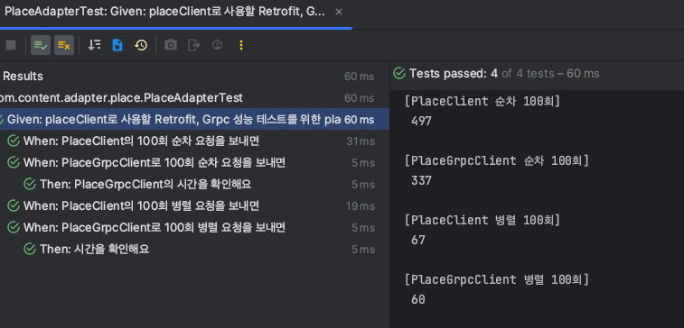
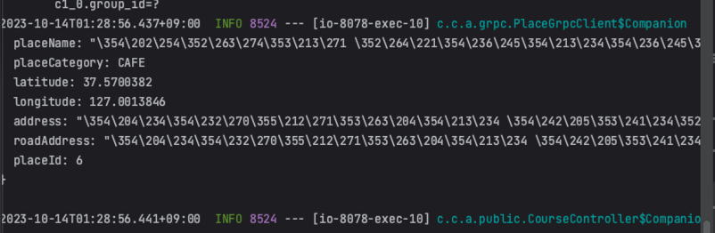

# Place 정보 gRPC 및 Retorit을 비교 후 gRPC-Retrofit 함께 처리하기

<br/>

## 1. 배경

- 유저가 코스를 작성할 때, 하나의 코스 그룹에 해당하는 코스들의 정보를 제공하고 있어요.
- 가게 정보는 서버 비용의 문제로, 유저 서버에서 같이 관리하고 있어요.
    - 컨텐츠 서버는 코스, 리뷰 등의 역할을 수행하고 있어서, 가게 관리의 역할까지 부여하면 서버 부하가 많을 것이라고 판단했어요.
- 가게 정보를 요청하는 요구 사항은 두 가지에요.
    - 하나의 코스를 선택하고 다음 코스를 보여줄 떄, 유저가 선택한 코스의 가게 정보를 보여줘야 했어요.
        - 유저가 코스를 등록하면, courseId와 함께 내려주고 있고 이 courseId를 클라이언트가 동기로 필요한 로직이 있어서 해당 요청은 동기로 주어야 했어요.
    - 유저들이 작성한 코스 리스트를 확인할 떄, 가게들의 정보를 보여줘야 했어요.
        - 해당 기능은 비동기로 작동해요.
- <span style="background-color:#FF9D6D;color:black"><b>Content Server는 코스에 placeId만 가지고 있어서 이 placeId로 유저 서버에 Place의
  정보를 가져와야 했어요.</b></span>

<br/>

## 2. 기존 방식과 도입 배경

- [retorit을 활용하여, 유저 서버로 HTTP/1.1 요청을 수행했어요.](https://github.com/DayPlan-Team/dayplan-cotent-api/commit/107367df0a8186d3947570b2404f9d166a9bfcd1#diff-e4a20b1b3d377d9641c771043db14c9f83b4e1071b5d06c596efcfb7494dc9d4)

``` kotlin
    @Headers(ApiClientUtil.CONTENT_TYPE_APPLICATION_JSON)
    @GET("/user/internal/place")
    fun getPlaceResponse(
        @Query("placeId") placeIds: List<Long>,
    ): Call<PlaceResponse>
```

- HTTP/1.1 프로토콜은 헤더의 크기가 크고, 많은 반복적인 데이터 전송으로 인한 불필요한 오버헤드가 걱정되었어요.
- 동시에 여러 요청을 처리하기 위해 여러 TCP 연결을 사용하며, 순차적 요청으로 전송 지연이 걱정되었어요.
- <span style="background-color:#FF9D6D;color:black"><b> 코스를 작성할 때마다 반복적인 요청이 수행될텐데, 캐싱 이전에 성능을 개선할 수 있는 방법을 고민하였어요.</b></span>
    - Redis는 비용 문제로 프리티어를 사용해야 하므로, 분산락을 목적으로 사용하려고 하고 있어요.

<br/>

## 3. gRPC 도입 배경

- gRPC는 Google에서 개발한 고성능, 오픈소스 및 범용 RPC 프레임워크로 스프링과 호환이 잘 되는 특징이 있어요.
- HTTP/2를 지원하여 더 작은 헤더 크기, 요청 및 응답의 다중화를 제공하여 서버간 통신을 개선할 수 있을 것이라고 판단하였어요.
- 인턴을 할 떄, gRPC를 알게 되었고 이를 활용하지 못했던게 한이 되어 꼭 적용해보고 싶다는 생각을 하였어요.

<br/>

## 4. gPRC 적용

- 헥사고날 아키텍처에서 보내는 측은 adapter 모듈에, 받는 측은 api 계층에 의존성을 추가하였어요. (루트는 컴파일 목적으로 추가하였어요.)

``` groovy
    implementation("io.grpc:grpc-kotlin-stub:1.3.0")
    implementation("com.google.protobuf:protobuf-java:3.24.3")
    implementation("io.grpc:grpc-netty-shaded:1.58.0")
    implementation("io.grpc:grpc-protobuf:1.58.0")
    implementation("net.devh:grpc-server-spring-boot-starter:2.15.0.RELEASE")
```

<br/>

- proto 파일을 정의하였어요.

``` protobuf
    syntax = "proto3";
    
    package place;
    
    service PlaceService {
      rpc GetPlace(GetPlaceRequest) returns (PlaceResponse) {};
    }
    
    message GetPlaceRequest {
      repeated int64 placeIds = 1;
    }
```

<br/>

- gRPC의 클라이언트 코드를 작성하였어요.

``` kotlin
    @Component
    class PlaceGrpcClient(
        @Qualifier("userManagedChannel") private val channel: ManagedChannel
    ) {
        fun getPlaceResponse(placeIds: List<Long>): List<Place.PlaceItem> {
            val stub = PlaceServiceGrpc.newBlockingStub(channel)
    
            val request = Place.GetPlaceRequest.newBuilder()
                .addAllPlaceIds(placeIds)
                .build()
    
            val response = stub.getPlace(request)
            return response.placesList
        }
```

<br/>

- 응답 결과에 대한 어뎁터 계층을 완성하였어요
- 해당 로직은, 유저에게 가게 상세 정보를 제공하는 것은 부가 요구 사항이에요. 따라서, 장애 발생시 emptyList()를 제공해도 문제가 없다고 판단하였어요.

``` kotlin
    @Component
    class PlaceAdapter(
        private val placeRetrofitClient: PlaceRetorfitClient,
        private val placeGrpcClient: PlaceGrpcClient,
    ) : PlacePort {
        override fun getPlaceByPlaceId(placeIds: List<Long>): List<Place> {
            try {
            
                if (placeIds.isEmpty()) return emptyList()
                return placeGrpcClient.getPlaceResponse(placeIds)
                    .map {
                        Place(
                            placeName = it.placeName,
                            // 중략
                        )
                    }
            } catch (e: Exception) {
                log.error("[PlaceAdapter Grpc Exception]", e)
            }
            return emptyList()
        }
```

## 5. 성능 비교

- Retrofit과 gRpc를 각각 적용하여 유의미한 성능 개선이 있는지 파악하였어요.
- 각 테스트는 수행하기 전에 약간의 warm-up을 적용하였고, 하나의 테스트 종료 이전에 1000ms의 sleep을 적용하였어요.

``` kotlin
    /* Warm-up */
    repeat(10) {
        val call = placeRetorifitClient.getPlaceResponse(placeIds = placeIds)

        val response = call.execute()
        if (response.isSuccessful && response.body() != null) {
            response.body()!!.places
        }
    }
```

<br/>

- 순차 100회 요청에 대한 테스트를 진행하였어요.

``` kotlin
    `when`("PlaceGrpcClient로 100회 순차 요청을 보내면") {
        /* Warm-up */
        repeat(10) {
            placeGrpcClient.getPlaceResponse(placeIds)
        }
    
        val startTime = System.currentTimeMillis()
        repeat(100) {
            placeGrpcClient.getPlaceResponse(placeIds)
        }
        val endTime = System.currentTimeMillis()
    
        then("PlaceGrpcClient의 시간을 확인해요") {
            println("[PlaceGrpcClient 순차 100회]\n ${endTime - startTime}\n")
        }
        Thread.sleep(1000L)
    }
```

<br/>

- 병렬 100회 요청에 대한 테스트를 진행하였어요.

``` kotlin
    `when`("PlaceGrpcClient로 100회 병렬 요청을 보내면") {
        val threadCount = 3
        val latch = CountDownLatch(threadCount)
        val executorService = Executors.newFixedThreadPool(32)
        
        /* Warm-Up 코드 중략 */
        
        val startTime = System.currentTimeMillis()
        repeat(100) {
            executorService.submit {
                try {
                    placeGrpcClient.getPlaceResponse(placeIds)
                } finally {
                    latch.countDown()
                }
            }
        }
```

<br/>

- 순차 요청은 5:5 정도로 비슷하게 gRpc가 빠르거나 Retrofit이 빨랐어요.
- 병렬 요청은 유의미하게 gRpc가 빠르다고 판단하였어요.
- <span style="background-color:#FF9D6D;color:black"><b>스프링은 여러 스레드를 이용하여 병렬로 처리할 수 있으므로 병렬 처리 속도를 우선적으로 보았어요.</b></span>
- 병렬 처리 테스트 결과 유의미하게 gRPC가 더 빠르다고 판단하여 이를 선택하게 되었어요.
  

## 6. 적용 결과

- 컨텐츠 서버 및 유저 서버를 모두 기동하여 정상적으로 gRPC가 응답하는 것을 확인 할 수 있었어요.
  

## 7. 개선 방안
- <span style="background-color:#FF9D6D;color:black"><b>사용자 친화적으로 정보를 제공하기 위해 grpc가 에러가 발생하는 경우 retrofit으로 요청해서 정보를 가져오는 로직으로 수정하였어요.</b></span>
``` kotlin
    @Component
    class PlaceAdapter(
        private val placeRetrofitClient: PlaceRetrofitClient,
        private val placeGrpcClient: PlaceGrpcClient,
    ) : PlacePort {
        override fun getPlaceByPlaceId(placeIds: List<Long>): List<Place> {
            if (placeIds.isEmpty()) return emptyList()
            return tryGrpcPlaces(placeIds) ?: tryRetrofitPlaces(placeIds) ?: emptyList()
        }
    
        private fun tryGrpcPlaces(placeIds: List<Long>): List<Place>? {
            return try {
                placeGrpcClient.getPlaceResponse(placeIds)
                    .map {
                        Place(
                            placeName = it.placeName,
                            placeCategory = PlaceCategory.valueOf(it.placeCategory.name),
                            latitude = it.latitude,
                            longitude = it.longitude,
                            address = it.address,
                            roadAddress = it.roadAddress,
                            placeId = it.placeId,
                        )
                    }
            } catch (e: Exception) {
                log.error("[PlaceAdapter Grpc Exception]", e)
                null
            }
        }
    
        private fun tryRetrofitPlaces(placeIds: List<Long>): List<Place>? {
            return try {
                val call = placeRetrofitClient.getPlaceResponse(placeIds = placeIds)
                val response = call.execute()
                if (response.isSuccessful && response.body() != null) {
                    getPlaceItem(response.body()!!.places)
                } else null
            } catch (e: Exception) {
                log.error("[PlaceAdapter Retrofit Exception]", e)
                null
            }
        }
```

## 8. 다음 목표
- 현재 동기 요청만 우선적으로 gRpc를 도입하였어요. 비동기 요청도 gRpc 도입 예정이에요.
