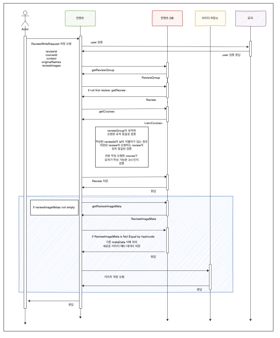

# 리뷰 작성을 설명해요.

## 1. 배경
- 유저가 데이트 코스를 등록한 후, 하나의 데이트 코스 그룹을 모두 방문하면 리뷰를 작성할 수 있어요!
- 리뷰는 하나의 데이트 코스 그룹의 코스 단위별로 작성할 수 있어요!.
- 리뷰는 사진들과 컨텐츠(글)로 구성되며, 유저는 글과 사진을 업로드 할 수 있어요!

<br/>

## 2. 리뷰 작성 플로우


<br/>

## 3. 리뷰 작성 플로우 설명
- 유저는 글과 내용을 작성하여 요청해요.
- 서버에서는 다음의 절차로 유저의 리뷰 작성 요청을 검증하고 저장해요.
  - 정상 유저를 검증해요(유저 서버로 유저의 상태를 요청한 후, 정상 유저만 플로우가 진행돼요!)
  - 리뷰는 작성 시점에 식별자가 생성이 돼요. 따라서, reviewId는 존재하거나 하지 않을 수 있어요.
  - 리뷰는 데이트 코스와 1:1로 매핑이 돼요. 이를 활용하여 클라이언트로부터 courseId를 받아서, 현재 리뷰가 있는지 없는지를 파악해요.
  - 만약 기존에 작성한 리뷰가 있다면 업데이트하고, 없다면 새로 저장해요.
  - 리뷰 이미지는 최대 10MB 까지 저장할 수 있어요. 유저가 작성한 이미지를 SHA-256으로 해시한 후, 해시코드를 메타 데이터에 저장해요.
    - reviewImageMeta는 리뷰를 수정할 떄마다, 이미지를 매번 덮어쓰기 하는 것이 부담이 되었어요.
    - 따라서, 유저가 리뷰를 편집하면 기존에 저장된 reviewId, sequence(사진의 순서), hashCode(이미지의 해시코드)를 비교하여 모든 값이 동일하면 덮어쓰지 않도록 하였어요.
  - 리뷰 이미지는 정의한 이미지 저장소(S3를 사용할 예정이에요)로 저장이 돼요.

<br/>

## 4. 코드 작성 - 도메인 정의
``` kotlin
  data class Review(
      val reviewId: Long,
      val reviewGroupId: Long,
      val courseId: Long,
      val content: String,
      val createdAt: LocalDateTime = LocalDateTime.now(),
      val modifiedAt: LocalDateTime = LocalDateTime.now(),
  )
```
- Review는 식별자와, 리뷰 그룹의 식별자, 작성하는 코스의 식별자, 리뷰 내용으로 구성돼요.

<br/>

``` kotlin
  data class ReviewGroup(
      val courseGroupId: Long,
      val reviewGroupId: Long,
      val reviewGroupName: String,
      val userId: Long,
      val createdAt: LocalDateTime = LocalDateTime.now(),
      val modifiedAt: LocalDateTime = LocalDateTime.now(),
  )
```
- ReviewImageMeta는 저장할 이미지의 메타 정보를 구성하는 도메인이에요.
- sequence(이미지의 순서), reviewId, originalName(이미지의 원래 이름), reviewImageHashCode(이미지의 해시 코드), reviewImageId(식별자), rename(새로 저장될 이름), imageUrl(이미지 경로)로 구성돼요.!

<br/>

``` kotlin
    data class ReviewImage(
        val image: ByteArray,
    ) {
        override fun equals(other: Any?): Boolean {
            if (this === other) return true
            if (javaClass != other?.javaClass) return false
    
            other as ReviewImage
    
            return image.contentEquals(other.image)
        }
    
        override fun hashCode(): Int {
            return sha256Digest.digest(image).contentHashCode()
        }
    
        companion object {
            private const val SHA256 = "SHA-256"
    
            val sha256Digest: MessageDigest by lazy {
                MessageDigest.getInstance(SHA256)
            }
        }
    }
```
- ReviewImage는 바이트 배열로 구성이 되고, 동일성 검증을 위해 해시코드를 이용해요.!
- SHA-256으로 해시화한 후, 해시코드로 동일성을 검증해요.
- 앞 서 정의한 ReviewImageHashCode는 ReviewImage의 해시화한 값이 저장되게 돼요!

<br/>

## 5. API 정의

``` kotlin
    data class ReviewWriteApiRequest(
        @JsonProperty("reviewId") val reviewId: Long,
        @JsonProperty("courseId") val courseId: Long,
        @JsonProperty("content") val content: String,
        @JsonProperty("originalNames") val originalNames: List<String>,
        @JsonProperty("reviewImageIds") val reviewImageIds: List<Long>,
        val reviewImages: List<MultipartFile>,
    ) {
        init {
            require(reviewImages.size == originalNames.size && originalNames.size == reviewImageIds.size) {
                throw ContentException(ContentExceptionCode.BAD_REQUEST_REVIEW)
            }

            require(reviewImages.sumOf { it.size } <= 10 * 1024 * 1024) {
                throw ContentException(ContentExceptionCode.BAD_REQUEST_REVIEW_IMAGE_SIZE)
            }
        }
    }
```
- 리뷰 이미지의 파일 크기는 최대 10MB를 만족해야해요!
- 이미지의 개수와, 이미지의 원래 이름 개수, 리뷰 이미지의 식별자의 개수(정책상 default = 0L)는 동일해야해요!

<br/>

``` kotlin
    private fun createReviewImages(reviewImages: List<MultipartFile>): List<ReviewImage> {
        return reviewImages.map {
            ReviewImage(
                image = it.bytes,
            )
        }
    }
```
- 유저에게 받은 파일은 바이트 배열로 바꿔서 List<ReviewImage>를 생성해요.

<br/>

``` kotlin
    private fun createReviewImageMeta(
        reviewImages: List<ReviewImage>,
        reviewWriteApiRequest: ReviewWriteApiRequest
    ): List<ReviewImageMeta> {
        return reviewImages.mapIndexed { index, reviewImage ->
            ReviewImageMeta(
                sequence = index + 1,
                reviewId = reviewWriteApiRequest.reviewId,
                originalName = reviewWriteApiRequest.originalNames[index],
                reviewImageHashCode = reviewImage.hashCode(),
                reviewImageId = reviewWriteApiRequest.reviewImageIds[index],
            )
        }
    }
```
- 생성한 reviewImages와 유저의 요청으로 부터 받은 reviewWriteApiRequest로 List<ReviewImageMeta>를 생성해요!

<br/>

``` kotlin
    private fun createReview(reviewWriteApiRequest: ReviewWriteApiRequest, userId: Long, reviewGroupId: Long): Review {
        return Review.from(
            reviewId = reviewWriteApiRequest.reviewId,
            userId = userId,
            reviewGroupId = reviewGroupId,
            courseId = reviewWriteApiRequest.courseId,
            content = reviewWriteApiRequest.content,
        )
    }
```
- 마지막으로 리뷰의 내용에 해당하는 Review를 요청으로부터 생성해요.

<br/>

``` kotlin
    @PostMapping
    fun writeReview(
        @RequestHeader("UserId") userId: Long,
        @PathVariable("reviewGroupId") reviewGroupId: Long,
        @ModelAttribute reviewWriteApiRequest: ReviewWriteApiRequest,
    ): ResponseEntity<Unit> {
        val user = userVerifyService.verifyNormalUserAndGet(userId)

        val review = createReview(reviewWriteApiRequest, user.userId, reviewGroupId)

        val reviewImages = createReviewImages(reviewWriteApiRequest.reviewImages)

        val reviewImageMetas = createReviewImageMeta(
            reviewImages = reviewImages,
            reviewWriteApiRequest = reviewWriteApiRequest,
        )

        reviewAndImageService.writeReviewAndImage(
            review = review,
            reviewImages = reviewImages,
            reviewImageMetas = reviewImageMetas
        )

        return ResponseEntity.ok().build()
    }
```
- 앞 서 정의한 함수를 바탕으로, 유저 검증(공통된 함수라 설명에서는 제외하였어요!), 리뷰 및 리뷰 이미지, 리뷰 메타정보를 생성하고 서비스에 인자로 넣어 서비스를 호출해요!

<br/>

## 6. ReviewAndImageService

``` kotlin
  @Service
  @Transactional
  class ReviewAndImageService(
      private val reviewGroupQueryPort: ReviewGroupQueryPort,
      private val courseQueryPort: CourseQueryPort,
      private val reviewWriteUseCase: ReviewWriteUseCase,
      private val reviewImageMetaCommandUseCase: ReviewImageMetaCommandUseCase,
  ) {
```
- 리뷰와 이미지를 저장하는 역할을 수행하는 서비스에요!
- 해당 서비스는 필요한 검증을 수행하고, ReviewWriteUseCase, ReviewImageMetaCommandUseCase를 호출해요.

<br/>

``` kotlin
  private fun verifyInvalidReviewWrite(user: User, review: Review, reviewGroup: ReviewGroup) {
        verifyReviewGroupOwner(reviewGroup.userId, user.userId)

        verifyReviewToCourse(review)

        verifyInvalidReviewCourse(
            courseGroupId = reviewGroup.courseGroupId,
        )
    }

    private fun verifyReviewGroupOwner(reviewGroupUserId: Long, userId: Long) {
        require(reviewGroupUserId == userId) { throw ContentException(ContentExceptionCode.USER_INVALID) }
    }

    /* A 코스 리뷰를 쓰려면, 동일한 코스 그룹에 있는 B, C 모두 리뷰를 쓸 수 있는 상태여야 해요!*/
    private fun verifyInvalidReviewCourse(courseGroupId: Long) {
        val courses = courseQueryPort
            .getCoursesByGroupId(courseGroupId)

        require(
            courses.any { it.visitedStatus && it.courseStage == CourseStage.PLACE_FINISH }
        ) {
            throw ContentException(ContentExceptionCode.BAD_REQUEST_REVIEW)
        }
    }

    private fun verifyReviewToCourse(review: Review) {

        reviewQueryPort.getReviewByCourseId(review.courseId)?.let {
            require(it.reviewId == review.reviewId) { throw ContentException(ContentExceptionCode.BAD_REQUEST_REVIEW) }
        } ?: run {
            require(review.reviewId == 0L) { throw ContentException(ContentExceptionCode.BAD_REQUEST_REVIEW) }
        }
    }
```
- 검증은 총 3가지로 구성이 돼요!
  - 리뷰 그룹의 작성자가 요청한 실제 유저여야 해요.
  - 리뷰와 코스는 1:1이므로 리뷰가 이미 존재하면, 요청하는 식별자와 동일해야하고, 만약 처음이라면 식별자는 0L어야 해요
  - A 코스에 대해 리뷰를 쓰려면, 동일한 코스 그룹에 속해있는 B, C 모두 리뷰를 쓸 수 있는 상태여야 해요!

<br/>

``` kotlin
  fun writeReviewAndSaveImage(user: User, review: Review, reviewImages: List<ReviewImage>, reviewImageMetas: List<ReviewImageMeta>) {
        val reviewGroup = getReviewGroup(review.reviewGroupId)

        verifyInvalidReviewWrite(
            user = user,
            reviewGroup = reviewGroup,
        )

        reviewWriteUseCase.writeReview(review = review)

        reviewImageMetaCommandUseCase.upsertReviewImageMeta(
            reviewImages = reviewImages,
            reviewImageMetas = reviewImageMetas
        )
    }
```
- 이를 바탕으로 리뷰를 쓰고, 이미지 및 메타 데이터를 호출해요!

<br/>

## 7. ReviewImageMeta 저장 
``` kotlin
  @Service
  @Transactional
  class ReviewImageMetaCommandService(
      private val reviewImageMetaCommandPort: ReviewImageMetaCommandPort,
      private val reviewImageMetaQueryPort: ReviewImageMetaQueryPort,
      private val reviewImageStoragePort: ReviewImageStoragePort,
  ) : ReviewImageMetaCommandUseCase {

```
- ReviewImageMetaCommandService는 리뷰 이미지의 메타정보를 저장하고, 스토리지에 이미지를 저장하는 역할을 수행해요.

<br/>

``` kotlin
  override fun upsertReviewImageMeta(
        reviewImages: List<ReviewImage>,
        reviewImageMetas: List<ReviewImageMeta>,
    ) {

        if (reviewImageMetas.isNotEmpty()) {
            processReviewImageByReviewId(
                reviewImages = reviewImages,
                reviewImageMetas = reviewImageMetas,
            )
        }
    }
```
- 만약 이미지가 비어있지 않다면, ReviewMetas를 저장하는 로직을 수행해요!

<br/>

``` kotlin
  private fun processReviewImageByReviewId(
        reviewImages: List<ReviewImage>,
        reviewImageMetas: List<ReviewImageMeta>,
    ) {
        when (reviewImageMetas.first().reviewId) {
            0L -> {
                saveReviewImageAndMetas(
                    reviewImages = reviewImages,
                    reviewImageMetas = reviewImageMetas,
                )
            }

            else -> {
                val findReviewImageMetas = reviewImageMetaQueryPort
                    .getReviewImageMetasByReviewId(reviewImageMetas.first().reviewId)
                    .sortedBy { it.sequence }

                upsertIfNotEqualBefore(reviewImageMetas, findReviewImageMetas, reviewImages)
            }
        }
    }
```
- 저장 방식은 크게 두가지로 나뉘게 돼요!
- 식별자가 존재하지 않는다면 첫 저장이므로 저장하고, 이미 식별자가 존재한다면, 해당 식별자로 저장된 reviewImageMeta를 가져와요.

<br/>

``` kotlin

  private fun upsertIfNotEqualBefore(
        reviewImageMetas: List<ReviewImageMeta>,
        findReviewImageMetas: List<ReviewImageMeta>,
        reviewImages: List<ReviewImage>
    ) {
        if (!reviewImageMetas.isEqual(findReviewImageMetas)) {
            deleteReviewImageMetaIfNotEmpty(findReviewImageMetas)

            saveReviewImageAndMetas(
                reviewImages = reviewImages,
                reviewImageMetas = reviewImageMetas,
            )
        }
    }

```
- 이미지의 메타데이터와 찾은 메타데이터가 동일하지 않다면 변경되었음을 의미해요!
- 따라서, 기존에 존재하는 메타데이터를 제거 처리하고 새로 저장해요

<br/>

``` kotlin
  fun List<ReviewImageMeta>.isEqual(other: List<ReviewImageMeta>): Boolean {
      if (this.size != other.size) return false
  
      return this.zip(other).all { (a, b) ->
          a.reviewId == b.reviewId && a.sequence == b.sequence && a.reviewImageHashCode == b.reviewImageHashCode
      }
  }
```
- 저장 되는 방식은 다음처럼 동일한 reviewId인지, 순서가 동일한지, 동일한 해시코드인지 확인해서 동일성을 검증해요.

<br/>

``` kotlin
  private fun deleteReviewImageMetaIfNotEmpty(reviewImageMetas: List<ReviewImageMeta>) {
        if (reviewImageMetas.isNotEmpty()) {
            reviewImageMetaCommandPort.deleteReviewImageMetas(reviewImageMetas)
        }
    }

    private fun saveReviewImageAndMetas(reviewImages: List<ReviewImage>, reviewImageMetas: List<ReviewImageMeta>) {
        reviewImageMetaCommandPort.upsertReviewImageMetas(reviewImageMetas)
        saveReviewImage(reviewImages = reviewImages, reviewImageMetas = reviewImageMetas)
    }

    private fun saveReviewImage(
        reviewImages: List<ReviewImage>,
        reviewImageMetas: List<ReviewImageMeta>
    ) {
        reviewImageStoragePort.saveReviewImageAndGetImageUrl(
            reviewImages = reviewImages,
            reviewImageStorages = reviewImageMetas.map {
                ReviewImageStorage(
                    name = it.imageName,
                    imageUrl = it.imageUrl,
                )
            }
        )
    }
```
- 이를 바탕으로 리뷰 이미지와 메타 정보를 저장할 수 있어요.!

<br/>

## 8. 테스트
- 각 테스트는 BehaviorSpec을 활용하여 모킹하여 테스트를 진행하였어요!
- [ReviewAndImageServiceTest](https://github.com/DayPlan-Team/dayplan-cotent-api/blob/main/application/src/test/kotlin/com/content/application/service/ReviewAndImageServiceTest.kt)
- [ReviewImageMetaCommandServiceTest](https://github.com/DayPlan-Team/dayplan-cotent-api/blob/main/application/src/test/kotlin/com/content/application/service/ReviewImageMetaCommandServiceTest.kt)

<br/>

## 9. TODO
- 리뷰가 작성된 코스는 더 이상 수정 불가하도록 제약 조건을 추가해주어야 해요!